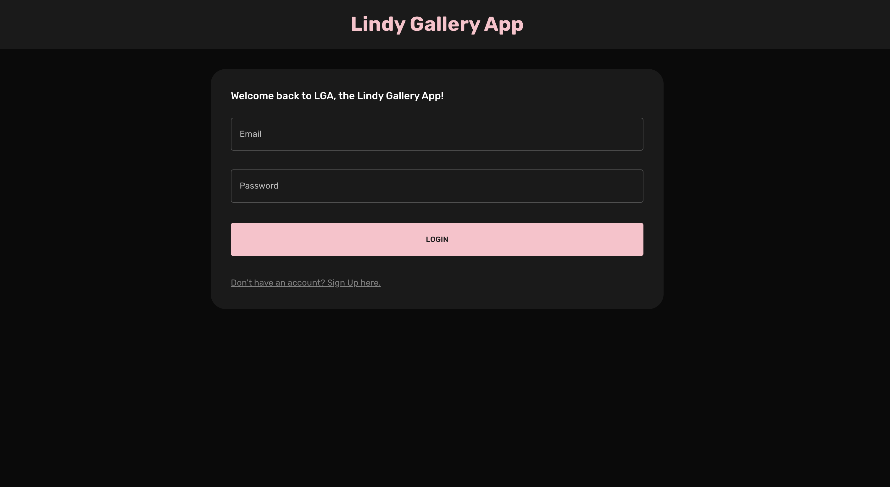
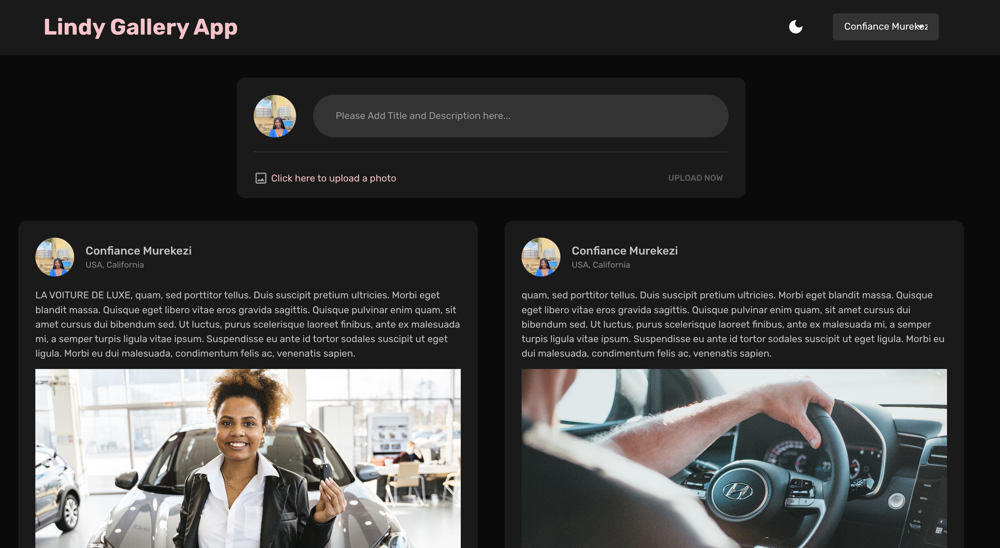

# Lindy Gallery App
> Will enable users to upload their pictures tagging them with title, & description.
They will be able to login, register with email and password, reset their password. 
Also users will be able to view all of his uploaded moments as well as all moments for others users.

## View on the project

## Built With

[] Major languages
- REACT (Redux)
- MUI
- CSS

## INSTALLATIONS

### `npm install`
### `npm start`

## Authors

👤 **Keza**

- GitHub: [Visit my github](https://github.com/keza681)
- LinkedIn: [Linkedin Profile](https://www.linkedin.com/in/linda-keza) 

## 🤝 Contributing

Contributions, issues, and feature requests are welcome😉

## Show your support

Leave a ⭐️ if you like this project!

## Acknowledgments

- Hat tip to anyone whose code was used

## 📝 License

This project is [MIT](/LICENSE) licensed

